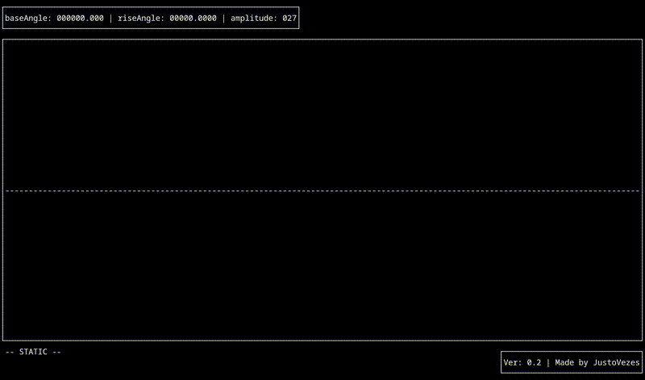
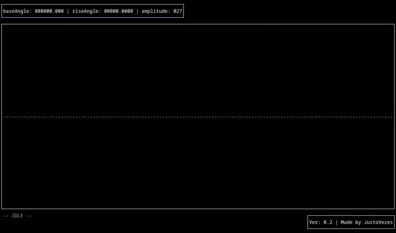
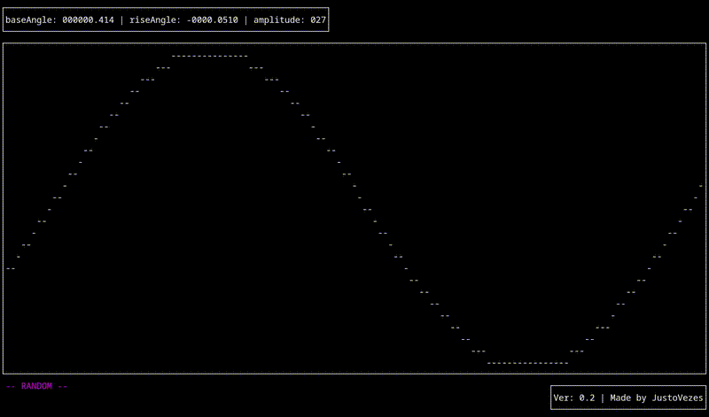

# ncurses-sineview
A sine wave visualizer written in C using the ncurses library.

*WARNING*: in certain terminals and/or modes, the screen may flicker due to the refresh amount, I tried my best to minimize the screen refreshes but the effect is still visible.

## requirements

*POSIX system

*ncurses library (dev)

*GCC/Make

## installation

inside the project's folder run `` make ``

then to execute, run: `` ./sineview ``

## usage

TAB:           switch to next mode

SHIFT + TAB:   switch to previous mode

upper arrow / scroll:  increase amplitude

lower arrow / scroll:  lower amplitude

left arrow: lower riseAngle

right arrow: increase riseAngle

p: quit

## program modes

### idle mode

### static mode

### continuous mode

### random mode (not very good)

